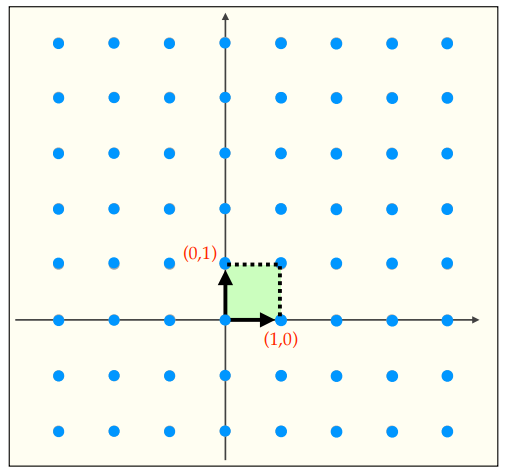
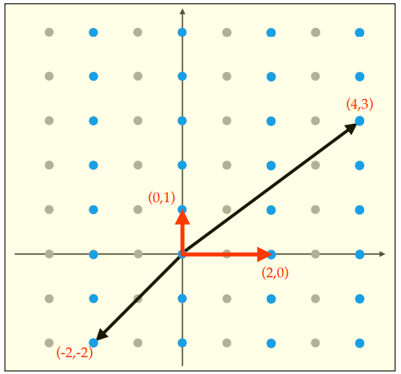

# Lattice-based Cryptography (Gitterbasierte Kryptographie)

## Key Concepts
Gitter (Lattices) sind regelmäßige Punktgitter in einem n-dimensionalen Raum.
Sie sind die Grundlage für aktuelle PQC-Verfahren (Kyber, Dilithium)

## Mathematical Foundation
Ein Gitter $L$ in $\mathbb{R}^n$ wird durch eine lineare Kombination von unabhängigen Vektoren $B = \{v_1, v_2, ..., v_m\}$ in $\mathbb{R}^n$ ($m \leq n$) aufgespannt. $B$ wird Basis von L genannt, und wird geschrieben als $L = L(B)$. $n$ ist die Dimension von L und $m$ ist der Rang von L. Jeder Punkt im Gitter ist eine ganzzahlige Linearkombination dieser Basisvektoren.

$$ L = \{ a_1 b_1 + ... + a_n b_n \mid a_i \in \mathbb{Z} \} \sube \mathbb{Z}^n $$

**Beispiel**

Sei ($n=2$) unnd $B_1 = \{(1,0), (0,1)\}$

Dann ist das Gitter $L_1 = L(B_1) = \{B_1 x : x \in \mathbb{Z}^2\}$, wobei
$$ B_1 = \begin{bmatrix} 1 & 0 \\ 0 & 1 \end{bmatrix} $$
Daraus folgt: $L_1 = \mathbb{Z}^n$ (Ein Full-rank Lattice, das Standardgitter aller ganzzahligen Punkte).

**Fundamental Parallelepiped:**
Das Fundamental-Parallelepiped $P(B_1)$ ist der Raum, der von den Basisvektoren aufgespannt wird:
$$ P(B_1) = \{ a_1(1,0) + a_2(0,1) : a_1, a_2 \in [0,1) \} $$

Das ist in der Grafik das grüne Quadrat.

### "Gute" und "Schlechte" Basen

Gegeben seien folgende 2 Gitter $L_2$ und $L_3$ für $n = 2$

Sei $B_2 = \{(2,0), (0,1)\}$ und $B_3 = \{(-2,-2), (4,3)\}$

Dann folgt $L_2 = L(B_2) = \{B_2 x : x \in \mathbb{Z}^2\}$, wobei
$$ B_2 = \begin{bmatrix} 2 & 0 \\ 0 & 1 \end{bmatrix} $$

und $L_3 = L(B_3) = \{B_3 x : x \in \mathbb{Z}^2\}$, wobei
$$ B_3 = \begin{bmatrix} -2 & 4 \\ -2 & 3 \end{bmatrix} $$

Es gilt $L_2 = L_3$, da beide Gitter dieselben Punkte enthalten. Das zeigt, dass ein Gitter durch verschiedene Basen erzeugt werden kann.

1.  $L_2 \subseteq L_3$, da die Basisvektoren von $B_2$ durch $B_3$ dargestellt werden können:
    $(2,0) = 3 \cdot (-2,-2) + 2 \cdot (4,3)$
    $(0,1) = -2 \cdot (-2,-2) - 1 \cdot (4,3)$

2.  $L_3 \subseteq L_2$, da die Basisvektoren von $B_3$ durch $B_2$ dargestellt werden können:
    $(-2,-2) = -1 \cdot (2,0) - 2 \cdot (0,1)$
    $(4,3) = 2 \cdot (2,0) + 3 \cdot (0,1)$

3.  Daraus folgt: $L_3 = L_2$.

**Eine Basis ist "besser" als die andere:**
*   $B_2$ ist eine **"gute" Basis**: Die Vektoren sind kurz und fast orthogonal
*   $B_3$ ist eine **"schlechte" Basis**: Die Vektoren sind lang und zeigen fast in dieselbe Richtung nur entgegengesetzt (kleiner Winkel)

Die Bedeutung für die Kryptographie:
Der Private Key ist die "gute Basis", der Public Key ist die "schlechte Basis" desselben Gitters.

### Volumen eines Gitters

Das Volumen eines Gitters $L$ ist definiert als $vol(L) = |det(B)|$. Das Volumen eines Gitters ist dessen Invariante, was bedeutet, dass es für jede Basis desselben Gitters gleich bleibt. Es ist umgekehrt proportional zur Dichte der Gittvektoren, wodurch es die Dichte der Gittervektoren beschreibt.

$$ \det(B_2) = (2 \cdot 1) - (0 \cdot 0) = 2 $$
$$ \det(B_3) = (-2 \cdot 3) - (4 \cdot -2) = -6 - (-8) = -6 + 8 = 2 $$

### Sukzessives Minima

Das sukzessive Minima beschreibt eine aufsteigende Rangliste der kürzesten Vektoren in einem Gitter $L$. Sie werden notiert mit $\lambda_i$.

- $\lambda_1(L)$ ist die Länge eines kürzesten Vektor im Gitter (Nullvektor ausgeschlossen)
- $\lambda_n(L)$ ist die kürzeste Länge um den gesamten n-dimensionalen Raum des Gitters aufzuspannen
- Wichtig: alle Vektoren sind linear unabhängig

**Bedeutung**: In jeder Basis ist der längste Basisvektor mind. so lang wie $\lambda_n$ ($max(||v_i||) \geq \lambda_n(L)$). Es ist also nicht möglich eine Basis zu finden in der alle Vektoren kúrzer sind als $\lambda_i$

### Lenstra-Lenstra-Lovász (LLL) 

Der LLL Algorithmus schafft es in polynomialer Zeit eine relativ kurze Basis für ein gegeben Gitter $L$ zu finden. Er beruht auf den Eigenschaften des Volumens und der sukzessiven Minima von Gittern. Er ist das grundlegende Tool um zu testen wie sicher gitterbasierte Verfahren sind.

Zum Beispiel: “Lattice attacks on digital signatures schemes”, Designs, Codes and Cryptography,
by N. Howgrave-Graham and N. Smart (2000)

Die "Qualität" der Basis verschlechtert sich, desto größer die Dimension $n$ des Gitters $L$. (Kyber768 --> $n=256$)

### Shortest Vector Problem (SVP)

Gegeben ist ein Gitter $L = L(B)$, finde einen Gittervektor der Länge $\lambda_1(L)$

- SVP ist NP-schwer, sowohl für normale Computer als auch Quantencomputer
- Klassisch: Die besten bekannten Algorithmen brauchen etwa $2^{0.292n}$ 
- Quantencomputer: ca. $2^{0.265n}$

Oft müssen Oscar und Eve nicht den absolut kürzesten Vektor finden, denn es reicht oft ein hinreichend kleiner Vektor. Das nennt man das approximative SVP - $SVP_\gamma$:

Gegeben ist ein Gitter $L = L(B)$, finde einen Gittervektor (nicht null) mit der maximalen Länge $\gamma \cdot \lambda_1(L)$

-  $SVP_\gamma$ ist NP-schwer für kleine konstante $\gamma$
- Wenn $\gamma$ sehr groß wird (z.B. $2^n$), dann kann der LLL-Algorithmus das Problem effizient lösen

### Shortest independant Vector Problem (SIVP)

Gegeben ist ein Gitter $L = L(B)$, finde $n$ linear unabhängige Vektoren, die nicht länger als $\lambda_n(L)$ sind.

- ebenfalls NP-schwer
- eine Lösung von SIVP muss nicht zwingend eine Basis von $L$ sein
- ebenfalls als approximative Variante (vergleiche $SVP_\gamma$)

## Impact on Project
Kyber's Sicherheit beruht darauf, dass das Lösen von Module-LWE so schwer ist wie das Lösen von SVP in einem Gitter

## LWE - SVP Zusammenhang (Bounded Distance Decoding)

Die Sicherheit von LWE basiert darauf, dass das Lösen der Gleichung äquivalent zu einem schweren Gitterproblem (Closest Vector Problem - CVP/BDD) ist.

### 1. LWE-Problem
LWE ist definiert als:
$$ b = As + e \pmod q $$

### 2. LWE-Gitter ($L_A$)
Wir können ein Gitter $L_A$ definieren, das von den Spalten der Matrix $A$ aufgespannt wird 
$$ L_A(A) = \{ y \in \mathbb{Z}^m \mid y \equiv As \pmod q \text{ für ein } s \in \mathbb{Z}_q^n \} $$
Der Term $As \pmod q$ ist also nichts anderes als ein spezifischer Punkt in $L_A$

### 3. Bounded Distance Decoding (BDD)
Auf $L_A$ wird der Fehler $e$ angewendet:
*   Wenn $e = 0$, dann wäre $b = As$ --> $b$ ist ein Gitterpunkt
*   Wenn $e \neq 0$, dann wird durch $e$ der Punkt ein kleines Stück vom Gitterpunkt verschoben
*   $b$ liegt jetzt nicht mehr auf dem Gitter $L_A$, sondern zwischen den Gitterpunkten (jedoch nah an $As$)

**Oscar & Eve's Aufgabe**
Aus dem Punkt $b$, welcher kein Gitterpunkt, den exakten Gitterpunkt $v \in L_A$, der am nächsten an $b$ liegt finden.

Dieses Problem nennt man **Bounded Distance Decoding (BDD)** (oder Closest Vector Problem, CVP).

BDD kann auf das Shortest Vector Problem (SVP) reduziert werden (siehe Regev). Dadurch gilt:
**Wenn Oscar und Eve LWE lösen können, können sie auch das SVP lösen.**

## Resources
- **[Alfred Menezes 2024]** Alfred Menezes. *THE MATHEMATICS
OF LATTICE-BASED CRYPTOGRAPHY*. https://cryptography101.ca/wp-content/uploads/2025/01/Lattices-4-slides.pdf

## Open Questions/ToDo

- genauere Erklärung von der LWE-SVP Brücke + Beweis wie BDD auf SVP reduziert wird
