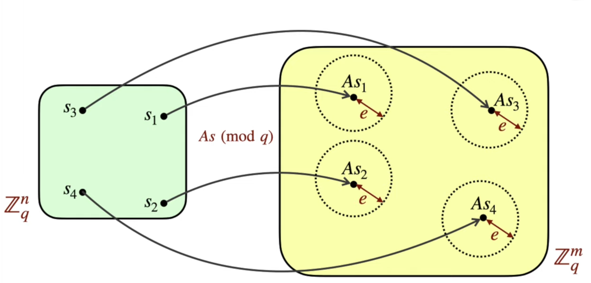
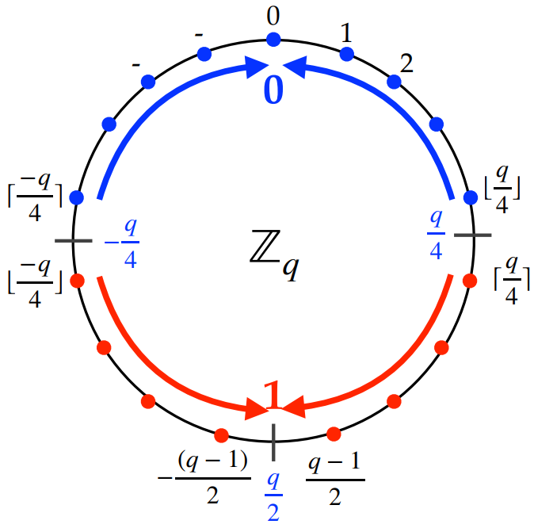

# Learning with Errors

## Key Concepts

LWE basiert auf Gleichungssystemen mit Fehlertermen, bei denen es unmöglich ist die Lösung zu bestimmen. Solch ein Gleichungssystem stellt den Public Key dar, in welchem Bob seine Nachricht verschlüsselt

## Mathematical Foundation

Folgendes Gleichungssystem sei angenommen und stellt den Public Key dar:

$$
\begin{aligned}
77x + 7y + 28z + 23w &= 2859 \\
21x + 19y + 30z + 48w &= 3508 \\
4x + 24y + 33z + 38w &= 3848 \\
8x + 20y + 84z + 61w &= 6225 \\
...
\end{aligned}
$$

Alice hat ihren Private Key um dieses Gleichungssystem zu lösen:
$$
\begin{aligned}
x &= 10 \\
y &= 82 \\
z &= 50 \\
w &= 5
\end{aligned}
$$

Jedoch ist es für einen Computer sehr einfach das Gleichungssystem zu lösen, da es sich um ein lineares Gleichungssystem handelt. Das Ganze nennt man Learning Without Errors.

Um dieses Problem zu lösen wird ein Fehlerterm hinzugefügt, der das Gleichungssystem nicht mehr lösbar macht. Dies nennt man dann Learning With Errors.

Dafür wird auf das Ergebnis jeder Gleichung ein Fehlerterm hinzugefügt:
$$
\begin{aligned}
77x + 7y + 28z + 23w &= 2859 + -3\\
21x + 19y + 30z + 48w &= 3508 + 2\\
4x + 24y + 33z + 38w &= 3848 + -1\\
8x + 20y + 84z + 61w &= 6225 + 0\\
...
\end{aligned}
$$

Dadurch kann das Gleichungssystem nicht mehr gelöst werden, da nur Alice weiß welche Fehlertermen hinzugefügt wurden und nur sie den Private Key besitzt.

Wie standardmäßig in der Kryptographie wird hier mit modularer Arithmetik (mod) gearbeitet.

$$
\begin{aligned}
77x + 7y + 28z + 23w &= 2859 \bmod 89 &= 11\\
21x + 19y + 30z + 48w &= 3508 \bmod 89 &= 37\\
4x + 24y + 33z + 38w &= 3848 \bmod 89 &= 21\\
8x + 20y + 84z + 61w &= 6225 \bmod 89 &= 84\\
...
\end{aligned}
$$

### Verschlüsselung

Für das Verschlüsseln nimmt Bob eine zufällige Menge an Gleichungen aus dem Public Key und addiert diese:

$$
\begin{aligned}
21x + 19y + 30z + 48w &= 37 + 2 \bmod 89\\
4x + 24y + 33z + 38w &= 21 + -1 \bmod 89\\
5x + 24y + 79z + 27w &= 51 + -2 \bmod 89\\
\hline
30x + 67y + 53z + 24w &= 19 + -1 \bmod 89\\
\end{aligned}
$$

Wenn Bob nun "0" senden möchte sendet er die neue Gleichung:

$$
\begin{aligned}
30x + 67y + 53z + 24w &= 19 + 0\bmod 89\\
\end{aligned}
$$

Wenn Bob "1" senden möchte sendet er die neue Gleichung plus 44:

$$
\begin{aligned}
30x + 67y + 53z + 24w &= 19 + 44 \bmod 89\\
\end{aligned}
$$

44 ist die Hälfte von 89 abgerundet (Modulo Arithmetik)

### Entschlüsselung

Bob sendet folgende Gleichung:

$$
\begin{aligned}
49x + 85y + 3z + 78w &= 81\bmod 89\\
\end{aligned}
$$

Das Ergebnis 81 besteht aus 2 Teilen:
- der echten Lösung
- dem enkodierten Bit

Alice nutzt ihren Private Key um die Gleichung zu lösen:

$$
\begin{aligned}
49 \cdot 10 + 85 \cdot 82 + 3 \cdot 50 + 78 \cdot 5 &= 79 \bmod 89\\
\end{aligned}
$$

79 ist die echte Lösung, wodurch das enkodierte Bit der Rest 2 ist. Jedoch sollte das Bit 0 oder 44 sein, durch den Fehler (Rauschen) wurde der echte Wert jedoch verschoben. Da Alice jedoch diese Information hat und weiß das wir mit Modulo 89 rechnen, ist die Lösung entweder nahe 0 oder nahe 44 (Regev-Encyption von Oded Regev). 2 ist näher an 0 als an 44, wodurch Alice weiß das der Bit 0 ist.

### Bedingungen

- Bob muss eine zufällige Menge an Gleichungen aus dem Public Key auswählen und darf nicht nur eine Gleichung nehmen, da Angreifer dann wissen welche Gleichung verwendet wurde
- Alice kann die Nachricht falsch entschlüsseln, wenn Bob zu viele Gleichungen addiert und die Summe der Fehler größer als (q/4) wird

## Formal Definitons

### Mathematische Definition von LWE

**Definition:** Learning With Error problem: $\text{LWE}(m, n, q, B)$

Sei $s \in_R \mathbb{Z}_q^n$ (geheim, zufällig gewählt) und $e \in_R [-B, B]^m$ (Fehler, zufällig aus kleinem Intervall), wobei $B \ll q/2$.

- **$q$ (Modulus):** Alle Zahlen sind begrenzt auf den Bereich $[0, q-1]$ (bzw. $[-q/2, q/2]$)
- **$n$ (Dimension des Geheimnisses):** Die Länge des geheimen Vektors $s$
- **$m$ (Anzahl der Gleichungen):** Das entspricht der Anzahl der Zeilen in Matrix $A$.Wie viele Gleichungen bekommt der Angreifer?
- **$B$ (Schranke):** Die maximale Größe des Fehlers
    *   Der Fehler $e$ wird nicht aus dem ganzen Raum $q$ gewählt, sondern ist "klein": $e \in [-B, B]$.
    *   $B \ll q$ (B muss sehr viel kleiner als q sein), sonst ist der Fehler nicht mehr zu unterscheiden.

Gegeben $A \in_R \mathbb{Z}_q^{m \times n}$ (öffentliche Matrix) und
$$ b = As + e \pmod q \in \mathbb{Z}_q^m $$
Finde $s$.

### Wahl des Parameters $B$

1. $B=0$ (Kein Fehler): $As = b \pmod q$ kann einfach berechnet werden
2. $B \approx q/2$ (Maximal großer Fehler): $B$ ist so groß, dass $b$ rein zufällig gewählt wird, wodurch $s$ nicht auffindbar ist
3. $B < \sqrt{n}$ (Arora-Ge Attacke): Ist der Fehler da, aber zu klein kann er durch Algorithmen (z.b. Arora und Ge) in effizienter Zeit gelöst werden

**Fazit:** Der Fehlerparameter $B$ muss sinnvoll gewählt werden, damit LWE sicher funktioniert

### $m \gg n$ (Eindeutigkeit der Lösung)

Die Bedingung $m \gg n$ stellt sicher, dass es **nur eine einzige** Lösung für $s$ gibt.

1.  **Mapping:** Matrix $A$ bildet jedes mögliche Geheimnis $s$ auf einen Punkt $As$ im Ergebnisraum ab
2.  **Fehler:** Durch den Fehlerterm $+e$ wird dieser exakte Punkt $As$ leicht "versetzt". Das Ergebnis $b$ landet irgendwo in einer kleinen Bereich um $As$ herum. Der Radius dieses Bereiches wird durch $B$ bestimmt
3.  **Das Problem:** Wenn zwei verschiedene Geheimnisse $s_1$ und $s_2$ so nah beieinander abgebildet würden, dass sich ihre Fehler-Bereiche überlappen, dann wäre ein Punkt im Überlappungsbereich nicht eindeutig zuweisbar
4.  **Die Lösung ($m \gg n$):**
    *   Der Zielraum hat $m$ Dimensionen ($\mathbb{Z}_q^m$), der Startraum nur $n$ ($\mathbb{Z}_q^n$).
    *   Da $m$ viel größer ist, ist der Zielraum exponentiell viel größer (und somit "leerer") als der Startraum
    *   Die Punkte $As$ liegen dadurch extrem weit verstreut, wodurch die Wahrscheinlichkeit, dass sich zwei Fehler-Kugeln berühren gegen Null geht

**Fazit:**
Der Angreifer bekommt dadurch mehr Gleichungen ($m$) als Unbekannte ($n$). Theoretisch wäre ein lineares Gleichungssystem damit sofort lösbar (überbestimmt), jedoch ist durch den Fehler sichergestellt, dass es schwer bleibt

(Quelle: Alfred Menezes THE MATHEMATICS
OF LATTICE-BASED
CRYPTOGRAPHY https://cryptography101.ca/wp-content/uploads/2025/01/Lattices-3-slides.pdf )

### Decisional LWE und ss-DLWE

1.  **Decisional LWE (DLWE):** Unterscheide Paare $(A, c)$, die wie oben erzeugt wurden ("echt"), von Paaren, die zufällig aus $\mathbb{Z}_q^n \times \mathbb{Z}_q$ gezogen wurden ("fake")

    **Definition:** $\text{DLWE}(m, n, q, B)$
    Gegeben $(A, c)$. Das Problem ist zu entscheiden, ob $c$ "echt" oder "fake" ist:
    1.  **Echt:** $c = b = As + e \pmod q$ (mit $s \in_R \mathbb{Z}_q^n, e \in_R [-B, B]^m$)
    2.  **Fake:** $c = r \in_R \mathbb{Z}_q^m$ (komplett zufällig, unabhängig von $A$)
    
    Die Wahrscheinlichkeit richtig zu liegen liegt bei $1/2$. Wenn das Problem "schwer" ist, kann kein effizienter Algorithmus gefunden werden, der mit einer besseren Wahrscheinlichkeit vorhersagt als $1/2$. Mit einem geeignet Beweis kann gezeigt werden, dass $DLWE \leq LWE$ und $LWE \leq DLWE$  (LWE und DLWE sind gleich schwer)

2.  **ss-LWE (Short-Secret LWE):**
    **Definition:** $\text{ss-LWE}(m, n, q, B)$

    Der Unterschied zum normalen LWE liegt im Geheimnis $s$:
    *   **LWE:** $s \in_R \mathbb{Z}_q^n$ (Zufällig aus dem gesamten Raum)
    *   **ss-LWE:** $s \in_R [-B, B]^n$ (Zufällig aus dem *kleinen* Fehlerintervall)

    Gegeben $A \in_R \mathbb{Z}_q^{m \times n}$ und $b = As + e \pmod q$.
    Finde $s$.

    Es kann wie bei DLWE auch hier bewiesen werden, dass $ss-LWE \leq LWE$ und $LWE \leq ss-LWE$ (LWE und ss-LWE sind äquivalent)
    
    **Relevanz:** Dadurch das $s$ kleiner ist, spart es Platz (= kleinere Keys) und Rechenzeit, ohne die Sicherheit zu verringern

3.  **ss-DLWE (Short-Secret Decisional LWE):**
    *   Kombination von ss-LWE und DLWE

## Lindner-Peikert PKE

### Ablauf

**1. Schlüssel Generierung - Alice:**
- Wählt geheimes $s \in_R [-B, B]^n$ und $e \in_R [-B, B]^n$.
- Wählt öffentliche Matrix $A \in_R \mathbb{Z}^{n \times n}_q$.
- Berechnet  $b$: $ b = A \cdot s + e $
- Alice's **public key** ist $(A,b)$, ihr **private key** ist $s$

Das berechnen irgendeiner Information von $s$ liegt im Schweregrad von $ss-DLWE(n,n,q,B)$

**2. Verschlüsselung - Bob:**
Bob will eine Nachricht $m \in \{0, 1\}$ an Alice senden:
1. Kopie von Alice's public key $(A,b)$
2. Wählt $r,z \in_R [-B,B]^n$ und $z' \in_R [-B,B]$
3. Berechnet $c_1 = A^Tr + z$ und $c_2 = b^T r + z' + m \lceil q/2 \rceil$
4. Schickt $c = (c_1, c_2)$

**3. Entrschlüsselung - Alice:**
Alice entschlüsselt $c = (c_1, c_2)$:
$$ m = Round_q(c_2 - s^T \cdot c_1) $$

**$Round_q$**: 

Um zu entschlüsseln, wird der signed modulo Operator benutzt: Dieser verschiebt die Werte in den Bereich $[-\frac{q-1}{2}, \frac{q-1}{2}]$, danach wird eine Rundungsfunktion verwendet.

1. **Signed Modulo ($x \text{ mods } q$):**
$$
x \text{ mods } q = \begin{cases} 
x & \text{wenn } x \le (q-1)/2 \\
x - q & \text{wenn } x > (q-1)/2
\end{cases}
$$
(Das zentriert die Werte um 0 herum)

2. **Round ($Round_q(x)$):**
$$
Round_q(x) = \begin{cases} 
0 & \text{wenn } -q/4 < (x \text{ mods } q) < q/4 \\
1 & \text{sonst}
\end{cases}
$$

**Erklärung:**
Wir schauen, ob der Wert näher an $0$ liegt (dann Bit 0) oder näher an $q/2$ bzw. $-q/2$ (dann Bit 1).

(Quelle: Alfred Menezes THE MATHEMATICS
OF LATTICE-BASED
CRYPTOGRAPHY https://cryptography101.ca/wp-content/uploads/2025/01/Lattices-3-slides.pdf )

### Beispiel (für Folien)

Statt riesiger Matrizen, hier mit kleinen Zahlen (Dimension 1, Modulo 100):

*   **Public ($A$):** 42
*   **Alice Secret ($s$):** 3 (klein)
*   **Alice Error ($e$):** 1 (klein)
*   **Alice Public Key ($b$):** $42 \cdot 3 + 1 = 127 \equiv 27 \bmod 100$

Alice veröffentlicht: $(A=42, b=27)$.

**Bob verschlüsselt Nachricht $m=1$ (codiert als 50):**
*   Bob Secret ($s'$): 2 (klein)
*   Bob Errors ($e', e''$): 1, -1
*   $u = 42 \cdot 2 + 1 = 85$
*   $v = 27 \cdot 2 + (-1) + 50 = 54 + 49 = 103 \equiv 3 \bmod 100$
Bob sendet $(u=85, v=3)$.

**Alice entschlüsselt:**
*   $v - s \cdot u = 3 - (3 \cdot 85) = 3 - 255 = -252 \equiv 48 \bmod 100$
*   Alice rundet $48$ zur nächsten "großen" Zahl (0 oder 50). $48 \approx 50$.
*   Decodiert: Nachricht $m=1$.

## Impact on Project

LWE ist die Grundlage für Gitter-Verschlüsselung, die von Kyber verwendet wird.
*   Kyber nutzt **Module-LWE**: Das ist exakt das obige Lindner-Peikert Schema, aber $A, s, e$ sind keine Zahlen/Vektoren, sondern Polynome.
*   Das Prinzip ($b = As+e$, $u=A^Ts'+e'$, etc.) bleibt mathematisch identisch.

## Resources and Quotes

- https://www.youtube.com/watch?v=K026C5YaB3A
- **[Alfred Menezes 2024]** Alfred Menezes. *THE MATHEMATICS
OF LATTICE-BASED CRYPTOGRAPHY*. https://cryptography101.ca/wp-content/uploads/2025/01/Lattices-3-slides.pdf
-   **[Lindner-Peikert 2010]** Richard Lindner and Chris Peikert. *Better Key Sizes (and Attacks) for LWE-Based Encryption*. Cryptology ePrint Archive, Paper 2010/613. [https://eprint.iacr.org/2010/613](https://eprint.iacr.org/2010/613)
