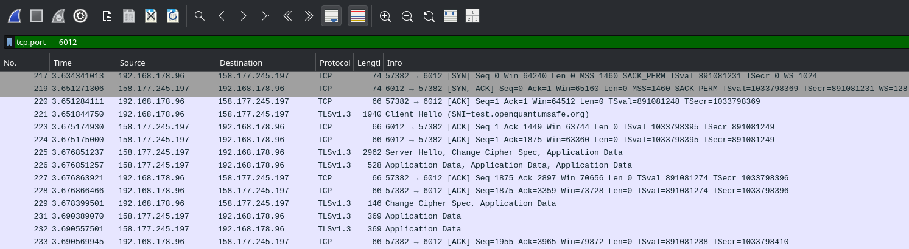
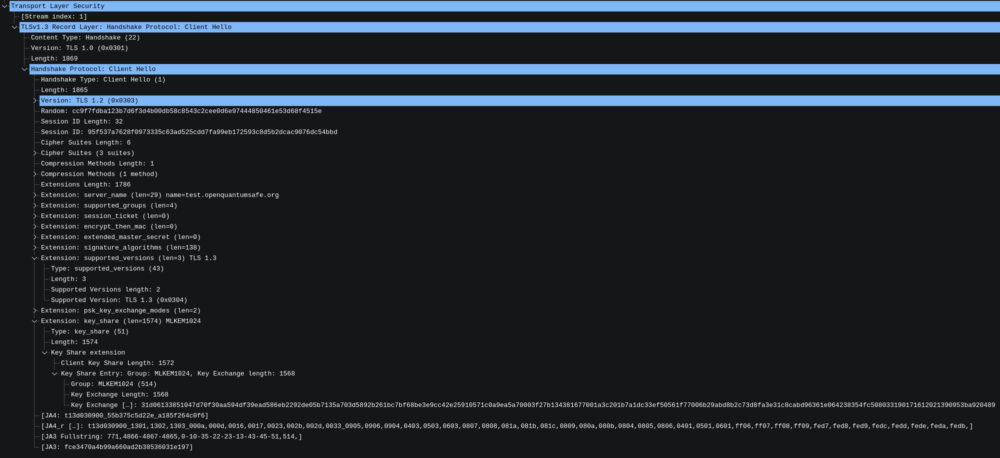
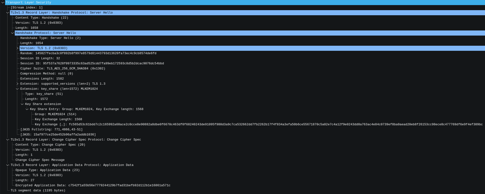

# Wireshark

## Handshake mit test.openquantumsafe.org

Verwendung des OQS-OpenSSL Docker-Containers:
```
docker run -it --rm openquantumsafe/oqs-ossl3 openssl s_client -connect test.openquantumsafe.org:6012 -groups mlkem1024 -tls1_3
```


## Overview


- Transport Layer: Standardkonformer TCP 3-Way-Handshake (Pakete 217–220)

- Protokoll: TLS 1.3 mit effizientem 1-RTT


## ClientHello


- Extension key_share: entscheidender Unterschied zu klassischem TLS

- Payload: Der Client sendet proaktiv den ML-KEM-1024 Public Key

- Datenmenge:
    - Größe: 1568 Bytes
    - Klassische Elliptische Kurven (ECC) benötigen hier nur ca. 32 Bytes

- Fragmentierung:
    - Wireshark zeigt ein großes Paket (ca. 2000 Bytes)
    - Das überschreitet die Internet-MTU (1500 Bytes)
    - Realität: Das Paket wird physikalisch von der Netzwerkkarte zerteilt (TCP Segmentation Offloading)


## ServerHello


- Cipher Suite: Einigung auf TLS_AES_256_GCM_SHA384 (Klassische AES-Verschlüsselung für die Nutzdaten)

- Key Encapsulation: Server bestätigt ML-KEM-1024 und sendet 1568 Bytes Ciphertext zurück

- Sicherheits-Level:
    - Handshake: Post-Quanten-Sicherheit durch ML-KEM

    - Record Layer: Klassische Sicherheit durch AES-256


## Ressources:

- https://test.openquantumsafe.org/