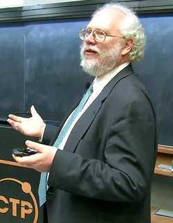

# Einleitung

### Gefahr von Quantencomputer:

- Peter Shor entwickelte 1994 einen Algorithmus der Shor's Algorithm genannt wird
- Shor's Algorithm kann RSA (Primfaktorzerlegung) und ECC (Diskreter Logarithmus) brechen
- "Harvest Now, Decrypt Later"
- **Fragestellung**: Was ist jedoch der Trade-Off von Post-Quanten Kryptographie?

Shor, Peter W. “Polynomial-Time Algorithms for Prime Factorization and Discrete Logarithms on a Quantum Computer.” SIAM Journal on Computing 26, no. 5 (1997): 1484–509. https://doi.org/10.1137/S0097539795293172.

[Peter Shor](https://en.wikipedia.org/wiki/Peter_Shor#/media/File:Peter_Shor_2017_Dirac_Medal_Award_Ceremony.png) in 2017

---

# Ablauf

1. Einleitung
2. Theorie
3. Standards und Technologien
4. Code & Setup
5. Auswertung 
6. Zusammenfassung

---

# Elliptic-curve Diffie-Hellman (ECDH)

Protokoll bei den Alice und Bob beide einen Public und Private Key haben um einen geheimen Schlüssel auszutauschen.

## Elliptische Kurven

- Format: $y^2 = x^3 + ax + b$
- **Skalar Multiplikation**: $A \to 2A \to 3A \to ... \to nA = C$
- Einfach $nA$ zu berechnen, schwer $n$ aus $A$ und $nA$ zu finden

## ECDH-Ablauf

**Parameter**:
- Elliptische Kurve $E$ über $\mathbb{Z}_p$ mit $n$ (prim)
- Ein Startpunkt $P \in E(\mathbb{Z}_p), P \neq \infty$
- Eine key derivation function (KDF), z.B. eine Hashfunktion (One-Way Function)

**Ablauf**:

1. Alice wählt $x \in_R [1,n-1]$ und berechnet $X=xP$
2. Alice sendet $X$ an Bob
3. Bob wählt $y \in_R [1,n-1]$ und berechnet $Y=yP$
4. Bob sendet $Y$ an Alice
5. Bob berechnet $K = yX$ und $k=KDF(K)$
6. Alice berechnet $K = xY$ und $k=KDF(K)$

**Problem:** ECDLP kann durch Shor's Algorithmus gelöst werden → Quantencomputer brechen ECDH

## X25519

Als Standard für eine elliptische Kurve wird oft die von Dan Bernstein in 2005 erfundene Curve25519 benutzt.

- $p = 2^{255} - 19$
- 128-bit Sicherheit, sehr schnell
- Die Curve25519 ist die elliptische Kurve $Y^2=X^3+48662X^2 + X$

---

# Post-Quanten-Kryptographie

Für Kyber benötigen wir folgende 2 Grundlagen: Gitter und LWE.

## Gitter

- Kombination von Vektoren $B = \{v_1, v_2, ..., v_m\}$
- $n$ ist die Dimension von L und $m$ ist der Rang von L
- $B$ wird Basis von L genannt
- jeder Punkt im Gitter ist eine ganzzahlige Linearkombination dieser Basisvektoren.

$$ L = \{ a_1 b_1 + ... + a_n b_n \mid a_i \in \mathbb{Z} \} \sube \mathbb{Z}^n $$

**Beispiel**

($n=2$) und $B_1 = \{(1,0), (0,1)\}$

$L_1 = L(B_1) = \{B_1 x : x \in \mathbb{Z}^2\}$, wobei
$$ B_1 = \begin{bmatrix} 1 & 0 \\ 0 & 1 \end{bmatrix} $$

**Fundamental Parallelepiped:**
$P(B_1)$ ist der Raum, der von den Basisvektoren aufgespannt wird:
$$ P(B_1) = \{ a_1(1,0) + a_2(0,1) : a_1, a_2 \in [0,1) \} $$

## "Gute" vs. "Schlechte" Basis

$L_2 = L_3$, da beide Gitter dieselben Punkte enthalten --> ein Gitter kann durch verschiedene Basen erzeugt werden

Die Bedeutung für die Kryptographie:
Der Private Key ist die "gute Basis", der Public Key ist die "schlechte Basis" desselben Gitters.

- **Gute Basis ($B_2$):** Vektoren kurz, fast orthogonal → **Private Key**
- **Schlechte Basis ($B_3$):** Vektoren lang, fast parallel → **Public Key**

## Shortest Vector Problem (SVP)

Gegeben ist ein Gitter $L = L(B)$, finde den kürzesten Gittervektor

- SVP ist NP-schwer, sowohl für normale Computer als auch Quantencomputer

---

# Learning with Errors (LWE)

## Kernidee

Lineares Gleichungssystem + **kleiner Fehler**

$$b = As + e \pmod q$$

- $A$: öffentliche Matrix
- $s$: geheimer Vektor (Private Key)
- $e$: kleiner Fehlervektor
- $b$: verrauschtes Ergebnis (Public Key)

## Was hat das mit Gittern zu tun?

Die Sicherheit von LWE basiert darauf, dass das Lösen der Gleichung äquivalent zu einem schweren Gitterproblem (Shorter bzw. Closest Vector Problem - SVP/CVP) ist.

## Beispiel mit Zahlen statt Vektoren (Dimension 1, mod 100)

**Alice:**
- $A = 42$, $s = 3$, $e = 1$
- $b = 42 \cdot 3 + 1 = 127 \equiv 27$
- Public Key: $(42, 27)$

**Bob verschlüsselt $m=1$:**
- Bob: $r = 2$, $e' = 1$, $e'' = -1$
- $u = 42 \cdot 2 + 1 = 85$
- $v = 27 \cdot 2 + (-1) + 50 = 103 \equiv 3$
- $c = (u,v) = (85,3)$

**Alice entschüsselt (85,3):**
- $v - s \cdot u = 3 - 3 * 85 = 3 * 255 \equiv 48$
- $48$ näher an $50$ als $0$ → $m = 1$ ✓

---

# Kyber/ML-KEM

## Von LWE zu Kyber

| Problem | Struktur | Trade-off |
|---------|----------|-----------|
| LWE | Zahlen/Vektoren | Sicher, aber riesige Keys |
| Ring-LWE | Polynome | Effizient, aber weniger flexibel |
| **Module-LWE** | Vektoren von Polynomen | **Kyber:** Balance aus Sicherheit & Effizienz |

## Kyber-PKE

**Parameter:** $q = 3329$, $n = 256$, $k \in \{2,3,4\}$, $\eta_1 = 2$, $\eta_2 = 2$

**Key Generierung:** $b = As + e$ → Public Key $(A, t)$, Private Key $s$

**Verschlüsselung:** $u = A^T r + e_1$, $v = b^T r + e_2 + \lfloor q/2 \rfloor \cdot m$

**Entschlüsselung:** $m = \text{Round}(v - s^T u)$

## KEM vs. Key Exchange

| | ECDH | Kyber-KEM |
|--|------|-----------|
| Prinzip | Beide berechnen den Schlüssel | Einer "kapselt" Schlüssel |
| Ergebnis | Shared Secret | Shared Secret |

## Fujisaki-Okamoto Transform

**Problem:** PKE ist nur gegen passive Angreifer sicher

**Lösung:** Bei Decaps wird Ciphertext **neu berechnet** und verglichen

### Ablauf

Encapsulation (Alice):
Alice möchte ein Shared Secret $K'$ für Bob kapseln

1. Ziehe eine Nachricht $m \in \{0,1\}^n$ gleichverteilt zufällig.
2. Berechne mittels einer Hashfunktion $G$ das Paar $(K, r) = G(m \parallel H(pk))$
  - $K$ ist ein Pre-Shared-Secret
  - $r$ wird als deterministische Zufallsquelle für den PKE-Algorithmus verwendet
3. **Verschlüsselung**: Berechne den Ciphertext $c = \text{PKE.Enc}(pk, m; r)$. Durch die Verwendung von $r$ aus Schritt 2 ist die Verschlüsselung hier für den gegebenen Seed $m$ deterministisch
4. Das Shared Secret ist $K' = H(K \parallel H(c))$. Dies bindet den Schlüssel an den Ciphertext $c$ 

Decapsulation (Bob):
Bob erhält $c$ und muss $K'$ extrahieren, während er gleichzeitig gegen aktive Angreifer prüft
1. **PKE-Entschlüsselung**: Berechne $m' = \text{PKE.Dec}(sk_{PKE}, c)$
2. Berechne die Werte $(K, r) = G(m' \parallel H(pk))$ analog zu Alice
3. **Re-Verschlüsselung**: Berechne $c' = \text{PKE.Enc}(pk, m'; r)$
  - Da die Verschlüsselung durch $r$ deterministisch ist, muss $c'$ gleich $c$ sein, sofern $c$ nicht manipuliert wurde
4. Falls $c' = c$: Gib $K' = H(K \parallel H(c))$ zurück
5. Falls $c' \neq c$: Gib $K' = H(z \parallel H(c))$ zurück

# Kyber und ECDH

Auf Grund von "Harvest Now, Decrypt Later" empfiehlt das BSI und NIST sogenannte **Hybrid-Verfahren**.

## Das Hybrid-Prinzip (X25519Kyber768)

Chrome und Cloudflare nutzen bereits dieses Verfahren.

Es werden **2** Schlüsselaustausche gleichzeitig durchgeführt

1. ECDH und Kyber werden unabhängig voneinander gleichzeitig ausgeführt
3. **Schlüssel-Kombination:**
   - Der finale Schlüssel $K$ wird aus beiden Secrets berechnet:
   - $K = \text{KDF}(\text{SharedSecret}_{\text{ECDH}} \ \| \ \text{SharedSecret}_{\text{Kyber}})$

**Vorteile:**
- Falls Kyber eine noch nicht entdeckte mathematische Schwäche hat, schützt ECDH.
- Falls Quantencomputer kommen, schützt Kyber.
